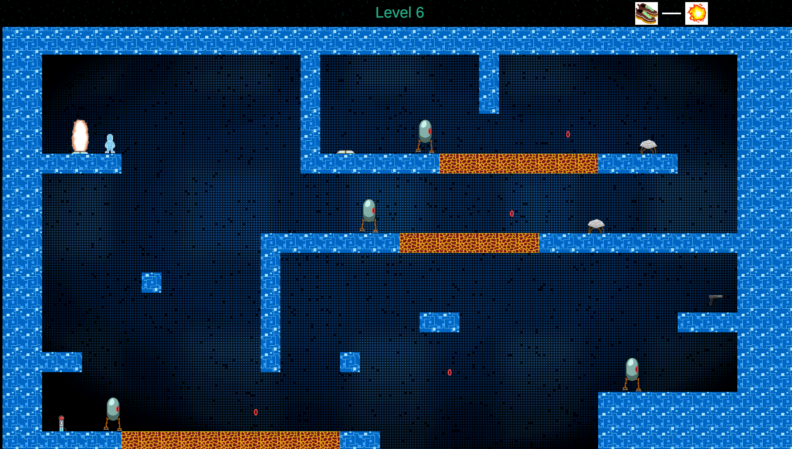

# Cyber Combo

2D platformer game made with Unity for IGDT 2021 game dev course.

Windows, Linux and macOS builds can be found from [releases](https://github.com/mjturt/cyber-combo/releases).

WebGL build might or might not be [here](https://cyber-combo.turtia.org/).

## Screenshot

## Authors

- Tuomas Lundén
- Jonna Judin
- Riku Helle
- Matias Mäkipelto
- Maks Turtiainen
- Milla Oksanen

## 3rd party assets

- DL Sounds
- qubodup
- Jute
- tfgcoder
